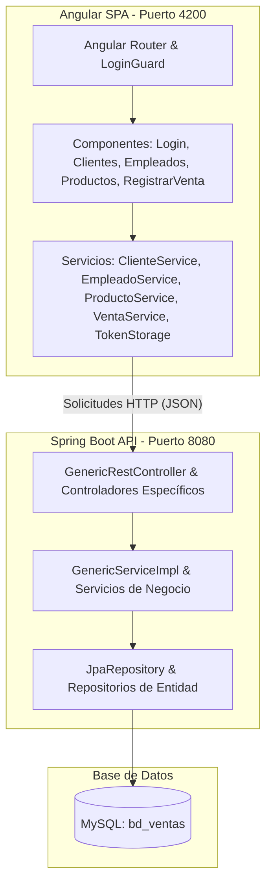

# Sistemas de Ventas Web (sistemasventasweb)

Este proyecto es una aplicación web empresarial moderna para la gestión y registro de ventas. Permite administrar clientes, empleados y productos en inventario, y procesar transacciones de venta con validaciones en tiempo real, actualización automática de stock y formateo automático de números de serie de facturación.

---

## Características Principales

*   **Arquitectura Genérica en el Backend**: Abstracción del CRUD clásico mediante clases genéricas (`GenericRestController`, `GenericServiceImpl`, `GenericServiceAPI`) que reducen la duplicación de código.
*   **Base de Datos Relacional**: Conexión e integración con MySQL usando Spring Data JPA e Hibernate con generación automática de esquemas y auditoría de fechas de venta mediante `@PrePersist`.
*   **Frontend SPA Moderno**: Interfaz interactiva construida en Angular 22 utilizando componentes standalone de alto rendimiento, formularios reactivos y componentes visuales premium a través de PrimeNG 21.
*   **Validaciones en Tiempo Real**: Control estricto de existencias de stock temporal en el frontend y validación persistente en el backend antes de descontar del inventario.
*   **Seguridad y Autenticación**: Manejo del estado del usuario logueado en la sesión mediante un guardián de rutas (`LoginGuard`) y almacenamiento local seguro de sesión.
*   **Alta Cobertura de Pruebas**: Suite de pruebas robusta en ambos lados (98 pruebas unitarias en Kotlin con JUnit 5/Mockito y 74 pruebas unitarias en Angular con Jasmine/Karma).

---

## Arquitectura

El sistema está dividido en dos partes principales que se comunican mediante servicios REST en formato JSON:

1.  **Frontend (Angular)**: Aplicación de página única (SPA) estructurada en componentes standalone y servicios de negocio.
2.  **Backend (Spring Boot)**: API REST construida bajo una arquitectura tradicional de capas que separa los controladores (HTTP), servicios (lógica de negocio), repositorios (acceso a base de datos JPA) y modelos (entidades del ORM).

### Diagrama de Arquitectura



---

## Requisitos Previos

Asegúrate de contar con el siguiente software instalado con las versiones exactas para garantizar la compatibilidad del compilador:

*   **Java**: JDK 25
*   **Node.js**: v20.x o superior
*   **Angular CLI**: v22.x
*   **Maven**: v3.9.x (o utilizar el wrapper `./mvnw` incluido)
*   **MySQL Server**: v8.x o superior (funcionando por defecto en el puerto 3306)

---

## Instalación Paso a Paso

Sigue estas instrucciones para clonar y preparar los dos entornos locales.

### Paso 1: Configurar la Base de Datos
1. Accede a tu consola o cliente de MySQL (por ejemplo, MySQL Workbench).
2. Crea el esquema de base de datos necesario para el proyecto:
   ```sql
   CREATE DATABASE bd_ventas CHARACTER SET utf8mb4 COLLATE utf8mb4_unicode_ci;
   ```

### Paso 2: Clonar y Preparar el Backend
1. Abre tu terminal en la raíz del repositorio.
2. Verifica que tienes configurado el JDK 25:
   ```bash
   java -version
   ```
3. Compila el backend descargando las dependencias de Maven:
   ```bash
   ./mvnw clean install -DskipTests
   ```

### Paso 3: Instalar Dependencias del Frontend
1. Navega a la carpeta `/web`:
   ```bash
   cd web
   ```
2. Instala las dependencias del proyecto Angular utilizando npm:
   ```bash
   npm install
   ```

---

## Configuración

La configuración del backend se encuentra en el archivo [application.yml](file:///c:/Users/minaj/Work/GitHub/Apps/sistemasventasweb/src/main/resources/application.yml). Puedes ajustar las propiedades según tu entorno local:

| Propiedad | Descripción | Valor de Ejemplo | Requerido |
| :--- | :--- | :--- | :--- |
| `spring.datasource.url` | URI de conexión JDBC a la base de datos MySQL | `jdbc:mysql://localhost:3306/bd_ventas?serverTimezone=UTC` | **Sí** |
| `spring.datasource.username` | Nombre de usuario de acceso a MySQL | `root` | **Sí** |
| `spring.datasource.password` | Contraseña de acceso a MySQL | `barcelona` | **Sí** |
| `spring.datasource.driver-class-name` | Driver de conexión JDBC de MySQL | `com.mysql.cj.jdbc.Driver` | **Sí** |
| `spring.jpa.show-sql` | Muestra en consola las consultas SQL generadas por Hibernate | `true` | No |
| `CDM.app.jwtSecret` | Clave secreta para la firma y verificación de tokens | `d16a249613a9969aca19846...` | **Sí** |
| `CDM.app.jwtExpirationMs` | Tiempo de expiración del token JWT en milisegundos | `86400000` (24 horas) | **Sí** |

---

## Ejecución del Proyecto

Sigue estos comandos para ejecutar ambos módulos en modo de desarrollo.

### Levantar el Backend (Spring Boot)
Desde la raíz del repositorio, ejecuta:
```bash
./mvnw spring-boot:run
```
*   La API REST estará disponible en: [http://localhost:8080](http://localhost:8080)
*   La documentación interactiva de OpenAPI/Swagger UI estará en: [http://localhost:8080/swagger-ui/index.html](http://localhost:8080/swagger-ui/index.html)

### Levantar el Frontend (Angular)
Desde el directorio `/web`, ejecuta:
```bash
npm start
```
o alternativamente:
```bash
npx ng serve
```
*   La interfaz de usuario del sistema estará disponible en: [http://localhost:4200](http://localhost:4200)

---

## Ejemplo de Uso Rápido (Flujo de Negocio Completo)

Sigue esta guía paso a paso para simular el proceso de inicio de sesión y registro de una venta completa:

1.  **Inicio de Sesión (Login)**:
    *   Navega a [http://localhost:4200/login](http://localhost:4200/login).
    *   Ingresa el **usuario** y **DNI** de un empleado registrado en la base de datos (por ejemplo, `user: emp01`, `dni: 44444444`).
    *   Haz clic en "Iniciar Sesión". El frontend enviará una petición a `/api/empleados/validar/emp01/44444444`. Si es correcto, guardará los datos en el `sessionStorage` e iniciará la sesión redirigiendo a la pantalla principal `/home`.
2.  **Registro de Venta**:
    *   Haz clic en la opción "Registrar Venta" en el menú de navegación superior.
    *   **Buscar Cliente**: En la sección de datos del cliente, introduce un DNI registrado (por ejemplo, `11111111`) y haz clic en "Buscar". La aplicación consultará `/api/clientes/dni/11111111` y cargará automáticamente los nombres del cliente.
    *   **Buscar Producto**: En la sección de productos, ingresa el ID del producto (por ejemplo, `1`) y presiona "Buscar". Se consultará `/api/productos/with-stock/1` para validar que exista y tenga stock > 0.
    *   **Agregar Producto**: Escribe la cantidad deseada (por ejemplo, `2`) y haz clic en "Agregar". El producto se sumará a la tabla inferior y se calculará el subtotal e IVA/Total acumulados en tiempo real.
    *   **Generar Venta**: Haz clic en el botón "Generar Venta". El sistema realizará los siguientes pasos secuenciales:
        1.  Obtendrá el siguiente número de serie disponible haciendo una llamada a `GET /api/ventas/serie`.
        2.  Guardará la cabecera de la venta mediante una petición `POST /api/ventas/save` con el cliente, empleado y monto total.
        3.  Guardará cada ítem de detalle de venta con `POST /api/detalle/save`.
        4.  Actualizará el stock disponible del producto restando la cantidad vendida a través de la petición `GET /api/productos/actualizar/{idProducto}/{cantidad}`.
        5.  Si todo es exitoso, mostrará un toast de éxito y redirigirá al usuario a `/home`.

---

## Estructura del Proyecto

### Backend (Spring Boot & Kotlin)
```
sistemasventasweb/
├── src/
│   ├── main/
│   │   ├── kotlin/com/bykenyodarz/sistemasventasweb/
│   │   │   ├── controllers/         # Controladores REST específicos de la API
│   │   │   ├── models/              # Entidades JPA (Cliente, Empleado, Producto, Venta, DetalleVenta)
│   │   │   ├── repositories/        # Interfaces Repositories de Spring Data JPA
│   │   │   ├── services/            # Lógica de negocio (apis/ define interfaces, impl/ la implementación)
│   │   │   ├── shared/              # Clases genéricas del CRUD (Controller, Service, ServiceImpl)
│   │   │   └── util/                # Clases de utilería (GenerarSerie)
│   │   └── resources/
│   │       ├── application.yml      # Configuración de base de datos MySQL y seguridad
│   │       └── static/              # Recursos estáticos
│   └── test/
│       └── kotlin/                  # 98 pruebas unitarias (JUnit 5 & Mockito)
├── mvnw                             # Maven Wrapper para entornos Linux/macOS
├── mvnw.cmd                         # Maven Wrapper para Windows
└── pom.xml                          # Dependencias de Maven, Kotlin y plugins
```

### Frontend (Angular 22 & TypeScript)
```
web/
├── src/
│   ├── app/
│   │   ├── core/
│   │   │   ├── models/              # Interfaces de datos y clases TypeScript del modelo
│   │   │   └── services/            # Servicios Angular de llamada a API (CommonService genérico)
│   │   ├── pages/
│   │   │   ├── login/               # Vista de login (Formulario reactivo)
│   │   │   └── resume/              # Panel principal y vistas CRUD
│   │   │       ├── components/      # Componentes específicos (RegistrarVenta, Clientes, Empleados, etc.)
│   │   │       └── resume-routing.module.ts # Enrutamiento interno del dashboard
│   │   └── app.routes.ts            # Enrutamiento raíz y guardián de rutas (LoginGuard)
│   ├── assets/                      # Imágenes, iconos y estilos globales
│   └── __tests__/                   # 74 pruebas unitarias (Jasmine & Karma)
├── angular.json                     # Configuración del CLI de Angular
├── package.json                     # Scripts y dependencias del frontend (PrimeNG, RxJS)
└── tsconfig.json                    # Opciones de compilación de TypeScript
```

---

## Ejecución de Tests

El proyecto cuenta con un alto estándar de calidad, implementando pruebas en ambos extremos.

### Ejecución de Pruebas en el Backend
Para ejecutar las 98 pruebas unitarias del backend utilizando JUnit 5 y Mockito, corre el siguiente comando en la raíz del proyecto:
```bash
./mvnw test
```

### Ejecución de Pruebas en el Frontend (Headless)
Para ejecutar las 74 pruebas unitarias del frontend utilizando Jasmine y Karma en un entorno headless (útil para integración continua), navega a la carpeta `/web` y corre:
```bash
npm run test -- --watch=false --browsers=ChromeHeadless
```

---

## Troubleshooting

### 1. Error de Conexión a la Base de Datos (`Access denied for user...` o `Connection refused`)
*   **Causa**: Las credenciales de MySQL especificadas en `application.yml` no coinciden con las de tu servidor MySQL local, o el servicio no está levantado.
*   **Solución**: Abre [application.yml](file:///c:/Users/minaj/Work/GitHub/Apps/sistemasventasweb/src/main/resources/application.yml) y ajusta los campos `username` y `password` con los de tu MySQL local. Además, confirma que MySQL esté corriendo en el puerto 3306 (`services.msc` en Windows o `sudo systemctl status mysql` en Linux).

### 2. Error al instalar dependencias en `/web` (`npm ERR! code ERESOLVE`)
*   **Causa**: Conflictos de dependencias entre la versión instalada de Node/npm y las versiones requeridas de Angular o PrimeNG.
*   **Solución**: Instala las dependencias forzando la resolución de compatibilidad:
    ```bash
    npm install --legacy-peer-deps
    ```

### 3. Error en la codificación de caracteres al insertar datos con tildes o "ñ"
*   **Causa**: La base de datos no fue creada con el charset correcto.
*   **Solución**: Asegúrate de que tu base de datos esté configurada con UTF-8 ejecutando:
    ```sql
    ALTER DATABASE bd_ventas CHARACTER SET utf8mb4 COLLATE utf8mb4_unicode_ci;
    ```

---

## Guía Rápida de Onboarding (Por dónde empezar a leer el código)

Si estás ingresando al proyecto por primera vez, te recomendamos seguir este flujo de lectura:

1.  **Entender el Modelo de Datos**: Comienza leyendo los archivos de entidad en el backend en `src/main/kotlin/com/bykenyodarz/sistemasventasweb/models/`. Aquí entenderás cómo interactúan las tablas de Clientes, Empleados, Productos y Ventas.
2.  **Ver la Estructura Genérica del CRUD**: Inspecciona `GenericRestController.kt` y `GenericServiceImpl.kt` dentro de `shared/`. Te dará una idea clara de cómo se exponen y resuelven automáticamente los endpoints `/all`, `/{id}`, `/save` y `/delete/{id}` sin escribir controladores redundantes.
3.  **Inspeccionar los Servicios Frontend**: Dirígete a `web/src/app/core/services/` y abre el archivo `common.service.ts` para ver cómo el frontend encapsula y hereda las llamadas HTTP a la API genérica del backend.
4.  **Revisar el Flujo de la Venta**: Estudia el componente `RegistrarVentaComponent` en `web/src/app/pages/resume/components/registrar-venta/registrar-venta.component.ts`. Es la sección más compleja del sistema y abarca validaciones, llamadas a múltiples APIs y manejo del estado local del carrito.
