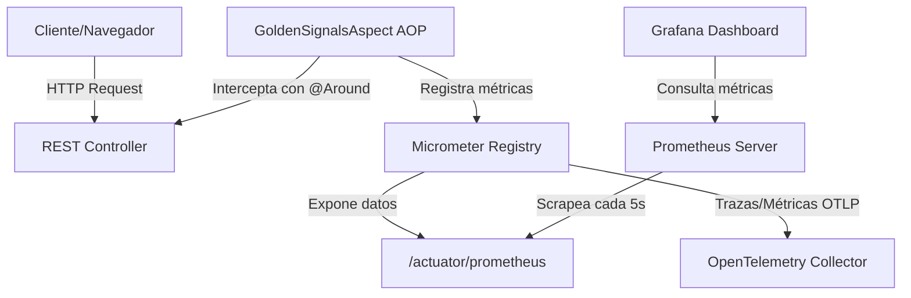

# Guía de Observabilidad: Monitoreo de las 4 Señales de Oro

Este documento detalla la arquitectura, el diseño y la guía de puesta en marcha del sistema de observabilidad implementado en el backend de **Spring Boot 4.x y Kotlin** para monitorear las **4 Señales de Oro** (Latencia, Tráfico, Errores y Saturación).

---

## 1. Las 4 Señales de Oro (SRE)

Para garantizar la fiabilidad del sistema, capturamos de manera activa las 4 señales recomendadas por Google SRE:

1. **Latencia:** El tiempo que toma procesar una solicitud HTTP (medido en segundos/milisegundos).
2. **Tráfico:** La demanda general del sistema, medida en el número total de solicitudes procesadas.
3. **Errores:** La tasa de solicitudes que fallan (excepciones lanzadas o respuestas con códigos HTTP 5xx).
4. **Saturación:** Qué tan "lleno" está el servicio. Se mide con el número de solicitudes simultáneas activas que se procesan concurrentemente en cada endpoint.

---

## 2. Arquitectura de la Solución

El flujo de recopilación y visualización de telemetría sigue la siguiente estructura:



---

## 3. Detalles de Implementación

### A. Instrumentación Dinámica con Spring AOP
En lugar de escribir código de métricas en cada endpoint, se utiliza Programación Orientada a Aspectos (AOP). El aspecto intercepta dinámicamente cualquier petición a los controladores REST:

* **Clase:** `com.bykenyodarz.sistemasventasweb.aspect.GoldenSignalsAspect`
* **Punto de corte (Pointcut):** Intercepta métodos dentro del paquete `com.bykenyodarz.sistemasventasweb.controllers` o métodos heredados de la base abstracta `GenericRestController`.

#### Registro de Señales en el Aspecto:
* **Tráfico:** Registrado mediante un contador (`Counter`) llamado `http_requests_total`.
* **Latencia:** Medido utilizando un temporizador (`Timer`) llamado `http_requests_latency_seconds`.
* **Errores:** Capturado con un bloque `try-catch` incrementando un contador (`Counter`) llamado `http_requests_errors_total` etiquetado con la clase de la excepción.
* **Saturación:** Evaluado mediante un medidor de estado (`Gauge`) llamado `http_requests_active`. Este lee un entero atómico (`AtomicInteger`) de forma concurrente, incrementándose al iniciar la petición y decrementándose en el bloque `finally`.

---

## 4. Infraestructura de Monitoreo (Docker Compose)

Se orquesta un entorno de monitoreo completo y plug-and-play a través de Docker Compose:

* **Prometheus:** Servidor de series temporales configurado para conectarse al endpoint `/actuator/prometheus` del backend de desarrollo (usando `host.docker.internal`).
* **Grafana:** Interfaz de visualización preconfigurada. Cuenta con aprovisionamiento automático del DataSource de Prometheus.
* **OpenTelemetry Collector:** Colector de telemetría OTLP configurado para recibir y registrar trazas enviadas por el backend.

---

## 5. Instrucciones de Uso y Puesta en Marcha

### Paso 1: Levantar los contenedores de monitoreo
Ejecuta el siguiente comando en la raíz del proyecto para iniciar Prometheus, Grafana y OTel Collector en segundo plano:
```bash
docker compose up -d
```

### Paso 2: Iniciar la aplicación Spring Boot
Arranca el backend desde tu IDE o consola usando el Maven Wrapper:
```bash
./mvnw spring-boot:run
```

### Paso 3: Interactuar con el sistema para generar telemetría
Puedes hacer llamadas REST desde tu cliente o navegador, por ejemplo:
* Obtener todos los clientes: `GET http://localhost:8080/api/clientes/all`
* Obtener todos los productos: `GET http://localhost:8080/api/productos/all`

### Paso 4: Visualizar las métricas
* **Prometheus Raw Data:** Accede a `http://localhost:8080/actuator/prometheus` para ver los datos sin procesar expuestos por el Actuator.
* **Consola de Prometheus:** Entra a [http://localhost:9090](http://localhost:9090) para realizar consultas PromQL directamente (ej. `http_requests_total`).
* **Paneles en Grafana:** Accede a [http://localhost:3000](http://localhost:3000) (Ingreso libre con usuario/contraseña `admin` / `admin`). El origen de datos de Prometheus ya estará configurado para que diseñes tus dashboards de SRE.
